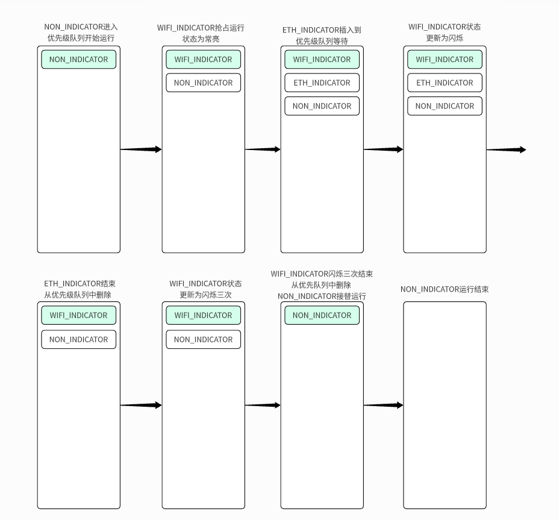

# led schedule

该组件采用优先级调度策略，每一个LED指示种类都应该有一个优先级，核心思想为将优先级维护为一个递减的有序队列，队列的首个元素为当前运行的LED指示内容，队首元素运行结束，从队列中删除，后续元素接替运行；

本例中使用了`NON_INDICATOR` `ETH_INDICATOR` `WIFI_INDICATOR` 三个类别作为演示，优先级从左到右依次增大；

从代码的下述行开始，即可将代码对应到图中内容：

```c
ESP_LOGI("LED", "------------------------Start priority test!!\n");
```

下面抽离的代码，可以对应优先级关系，以及图中的每一个运行步骤：

```c
typedef enum {
  NON_INDICATOR,
  ETH_INDICATOR,
  WIFI_INDICATOR,
  RESET_INDICATOR,
  CONFIG_INDICATOR
} mLEDPriority; // The maximum priority defined by MAX_NUMBER_OF_LED_PRIORITY

led_indicate_set(led0, NON_INDICATOR, LED_ON, 10, 10, 10); // Weak white light
led_indicate_set(led0, WIFI_INDICATOR, LED_ON, 100, 0, 0); // red light
led_indicate_set(led0, ETH_INDICATOR, LED_ON, 0, 100, 0); // green light
led_indicate_set_blink(led0, WIFI_INDICATOR, 100, 0, 100, 500, 500); // purple light
led_indicate_set_done(led0, ETH_INDICATOR); // off green light
led_indicate_set_count_blink(led0, WIFI_INDICATOR, 100, 100, 0, 500, 500, 3); // off yellow light after blink 3 times
led_indicate_set_done(led0, NON_INDICATOR); // off weak white light
```



